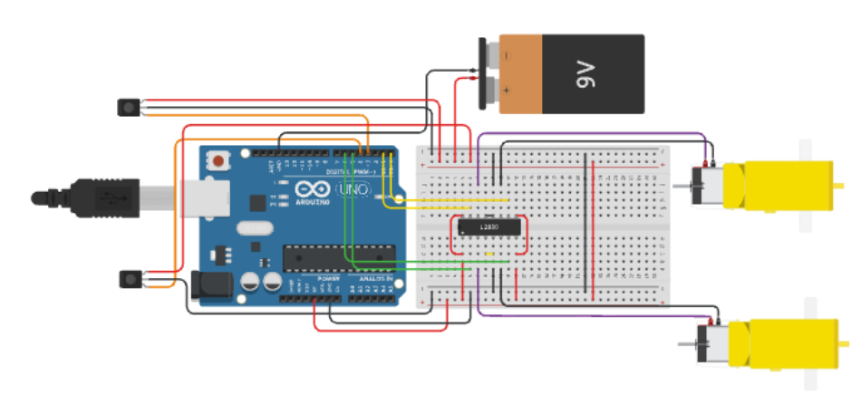
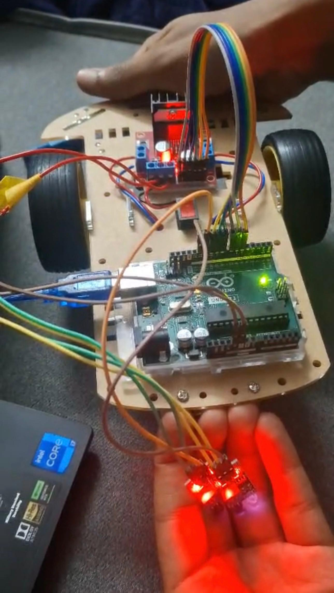

<h1 align="center">🤖 AutoStrider — Line Following Robot</h1>

  <b>A smart, Arduino-based line-following robot with real-world prototype & online simulation</b> 
  Built and tested by a team of students from Amrita Vishwa Vidyapeetham

---

## 🌐 Simulation Link
🔗 **Try it yourself:**  
[AutoStrider — Tinkercad Simulation](https://www.tinkercad.com/things/lGTo1RcW4o6-auto-strider?sharecode=RSIFxj7kJPw8u6VMCZKzwJHGUvhD_voBYZLE4GNoEdc)

---

## 🧩 Overview
**AutoStrider** is an intelligent line-following robot capable of autonomously following a black track using IR sensors.  
It’s powered by an Arduino UNO and uses an H-bridge motor driver for directional control.

The project was implemented **both in simulation (Tinkercad)** and as a **physical prototype**, validating real-world performance.

---

## ⚙️ Features
- Dual IR sensor module for line detection  
- Directional control using L293D driver  
- PWM-based speed control for balanced movement  
- Smooth line tracking logic (forward, left, right, stop)  
- Simulation & real hardware prototype  

---

## 🧠 Working Principle
- Two IR sensors continuously scan the surface below.
- Black line reflects less IR light → sensor outputs `LOW`.
- Depending on sensor output:
  - Both LOW → move forward  
  - Left LOW, Right HIGH → turn right  
  - Right LOW, Left HIGH → turn left  
  - Both HIGH → stop  

---

## 🧰 Components Used
| Component | Quantity | Description |
|------------|-----------|-------------|
| Arduino UNO | 1 | Main microcontroller |
| IR Sensor Module | 2 | Detects black line |
| L293D Motor Driver | 1 | Controls motor direction |
| DC Motors + Wheels | 2 | Motion mechanism |
| Robot Chassis | 1 | Base platform |
| Power Supply (9V/12V) | 1 | Motor + logic power |
| Connecting Wires | — | For circuit connections |

---

## 🔌 Circuit Connection

| Arduino Pin | Connection | Description |
|--------------|-------------|--------------|
| D11 | IR Sensor (Right) | Line detection |
| D12 | IR Sensor (Left) | Line detection |
| D6 | Enable Right Motor | PWM speed control |
| D7, D8 | Right Motor Direction | |
| D5 | Enable Left Motor | PWM speed control |
| D9, D10 | Left Motor Direction | |

🧭 Common Ground must be shared between Arduino and motor driver power.

---

## 🧾 Code
Complete Arduino sketch available in [`code/Autostrider.ino`](code/Autostrider.ino)

> The program reads IR sensor values, decides direction, and drives motors using PWM signals.

---

## 📸 Simulation & Prototype
| Type | Screenshot |
|------|-------------|
| **Tinkercad Simulation** |  |
| **Real-World Prototype** |  |

🎥 *You can include a short GIF or video link here to showcase it following a line.*

---

## 🚀 How to Run
1. Open `Autostrider.ino` in Arduino IDE  
2. Connect Arduino UNO via USB  
3. Select the correct board & COM port  
4. Upload the code  
5. Open **Serial Monitor** (9600 baud) to observe sensor readings  
6. Place robot on black line track and watch it follow autonomously!  

---

## 🔧 Calibration Tips
- Adjust `MOTOR_SPEED_LEFT` and `MOTOR_SPEED_RIGHT` for balanced speed.  
- Keep sensors 0.5–1cm above the track.  
- Use matte black electrical tape for better contrast.  

---

## 🎯 Future Enhancements
- Add **PID control** for smoother turns  
- Integrate **Bluetooth module** for manual control  
- Add **ultrasonic sensor** for obstacle avoidance  
- Implement **battery voltage monitoring**  

---

## 📜 License
This project is licensed under the [MIT License](LICENSE).

---
